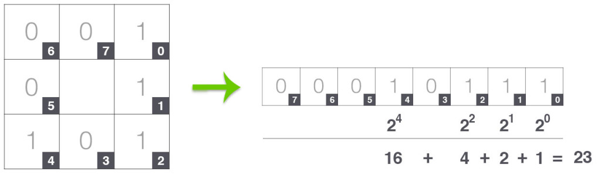
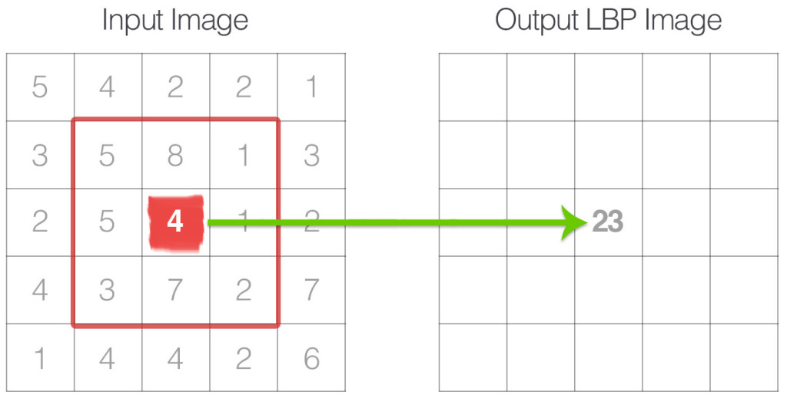

## Filtering features

## Histogram
A color histogram focuses only on the proportion of the number of different types of colors, regardless of the spatial location of the colors. The values of a color histogram are from statistics. 
They show the statistical distribution of colors and the essential tone of an image.In general, as the color distributions of the foreground and background in an image 
are different, there might be a bimodal distribution in the histogram. For the luminance histogram alone, there is no perfect histogram and in general, 
the histogram can tell whether it is over exposure or not, but there are times when you might think the image is over exposed by viewing the histogram; however, 
in reality it is not.
How create Histograms in OpenCV [tutorial](https://docs.opencv.org/master/d1/db7/tutorial_py_histogram_begins.html)

### RGB Histogram
The RGB histogram is a combination of three 1D histograms based on the R, G, and B channels of the RGB color space. This histogram having no invariance properties.

### RG Histogram
In the normalized RGB color model, the chromaticity components r and g describe the color information in the image . Because of the normalization, r and g are scaleinvariant, thus invariant to light intensity changes, shadows,
and shading.

### Transformed color distribution
An RGB histogram is not invariant to light changes. Scaleinvariance and shift-invariance is achieved with respect to light intensity by the pixel value normalization. Because each channel is independently normalized, the descriptor is
also normalized against changes in light color and arbitrary offsets.

## Texture features 
For browsing, searching and retrieval of images, texture can be a very useful feature. There is no formal definition for texture is known, but this descriptor provides measures
of the properties such as smoothness, coarseness, and regularity. Statistical, structural and spectral methods are used to measure the texture properties of an image. One
of the most known texture descriptors nowadays is GLCM.
The Gray Level Co-occurrence Matrix1 (GLCM) and associated texture feature calculations are image analysis techniques. Given an image composed of pixels each with an 
intensity (a specific gray level), the GLCM is a tabulation of how often different combinations of gray levels co-occur in an image or image section. 
Texture feature calculations use the contents of the GLCM to give a measure of the variation in intensity (a.k.a. image texture) at the pixel of interest.

Read [this](https://scikit-image.org/docs/dev/auto_examples/features_detection/plot_glcm.html)
**After try to recognice grass of a random photo and create a second algorithm to compare two grass in different image using the GLCM

Second [example](https://gogul.dev/software/texture-recognition)
**Run the code and create an algorithm to detect different texture.

### GLCM Entropy
Entropy shows the amount of information of the image that is needed for the image compression. Entropy measures the loss of information or message in a transmitted signal and
also measures the image information.
Run [this](https://scikit-image.org/docs/dev/auto_examples/filters/plot_entropy.html)
** Please try with other photo and detect different texture, for example use your fruit image.

### GLCM Correlation
Correlation measures the linear dependency of grey levels of neighboring pixels. When extracting the features of an image with GLCM approach ,at the time of RGB to GRAY level conversion
the image compression time can be greatly reduced.
Run [this](https://scikit-image.org/docs/dev/auto_examples/features_detection/plot_glcm.html)
** What is correlation?

### Haralick Texture Feature
The haralick textures are used for image classification. These features capture information about the patterns that emerge in patterns of texture. These kind of features are
calculated by using co-occurrence matrix, which is computationally expensive. You may find 13 features are belongs to this category.
* Energy
* Correlation
* Inertia
* Entropy
* Inverse Difference Momment
* Sum Average
* Sum Variance
* Sum Entropy
* Difference Average
* Difference Variance
* Difference Entropy
* Information measure of correlation 1
* Information measure of correlation 2

## Histogram of Oriented Gradients (HOG) feature descriptor
A feature descriptor is a representation of an image or an image patch that simplifies the image by extracting useful information and throwing away extraneous information.
Typically, a feature descriptor converts an image of size width x height x 3 (channels ) to a feature vector / array of length n. 
In the case of the HOG feature descriptor, the input image is of size 64 x 128 x 3 and the output feature vector is of length 3780.

This all sounds good, but what is “useful” and what is “extraneous” ? To define “useful”, we need to know what is it “useful” for ? 
Clearly, the feature vector is not useful for the purpose of viewing the image. But, it is very useful for tasks like image recognition and object detection. 
The feature vector produced by these algorithms when fed into an image classification algorithms like Support Vector Machine (SVM) produce good results.

But, what kinds of “features” are useful for classification tasks ? Let’s discuss this point using an example. 
Suppose we want to build an object detector that detects buttons of shirts and coats. A button is circular ( may look elliptical in an image ) and usually has a few 
holes for sewing. You can run an edge detector on the image of a button, and easily tell if it is a button by simply looking at the edge image alone. 
In this case, edge information is “useful” and color information is not. In addition, the features also need to have discriminative power. 
For example, good features extracted from an image should be able to tell the difference between buttons and other circular objects like coins and car tires.

In the HOG feature descriptor, the distribution ( histograms ) of directions of gradients ( oriented gradients ) are used as features. Gradients ( x and y derivatives ) 
of an image are useful because the magnitude of gradients is large around edges and corners ( regions of abrupt intensity changes ) and we know that 
edges and corners pack in a lot more information about object shape than flat regions.

Follow this [tutorial](https://www.learnopencv.com/histogram-of-oriented-gradients/).

## Color correlograms
A color correlogram (henceforth correlogram) expresses how the spatial correlation of pairs of colors changes with distance. Informally, a correlogram for an 
image is a table indexed by color pairs, where the d-th entry for row (i,j) specifies the probability of finding a pixel of color j at a distance d from a pixel 
of color i in this image. Here d is chosen from a set of distance values D. An autocorrelogram captures spatial correlation between identical colors only.

The highlights of the correlogram method are: (i) it includes the spatial correlation of colors, and (ii) it can be used to describe the global distribution 
of local spatial correlation of colors if D is chosen to be local. An additional advantage lies in the ability of our methods to succeed with very coarse color information.
Follow [this](https://realpython.com/python-opencv-color-spaces/) and type the example. 
** Question: Can you determinate if the fruit is mature or not only using color correlograms?

## Local Binary patterbs
ocal Binary Patterns, or LBPs for short, are a texture descriptor made popular by the work of Ojala et al. in their 2002 paper, 
Multiresolution Grayscale and Rotation Invariant Texture Classification with Local Binary Patterns ([paper](http://www.outex.oulu.fi/publications/pami_02_opm.pdf))
Unlike Haralick texture features that compute a global representation of texture based on the Gray Level Co-occurrence Matrix, LBPs instead compute a local representation of texture. 
This local representation is constructed by comparing each pixel with its surrounding neighborhood of pixels.

The first step in constructing the LBP texture descriptor is to convert the image to grayscale. For each pixel in the grayscale image, we select a 
neighborhood of size r surrounding the center pixel. A LBP value is then calculated for this center pixel and stored in the output 2D array 
with the same width and height as the input image.

n the above figure we take the center pixel (highlighted in red) and threshold it against its neighborhood of 8 pixels. If the intensity of the center pixel is greater-than-or-equal 
to its neighbor, then we set the value to 1; otherwise, we set it to 0. With 8 surrounding pixels, we have a total of 2 ^ 8 = 256 possible combinations of LBP codes.

From there, we need to calculate the LBP value for the center pixel. We can start from any neighboring pixel and work our way clockwise or counter-clockwise, but our 
ordering must be kept consistent for all pixels in our image and all images in our dataset. Given a 3 x 3 neighborhood, we thus have 8 neighbors 
that we must perform a binary test on. The results of this binary test are stored in an 8-bit array, which we then convert to decimal, like this:
4

In this example we start at the top-right point and work our way clockwise accumulating the binary string as we go along. We can then convert this binary string to decimal, 
yielding a value of 23. This value is stored in the output LBP 2D array, which we can then visualize below:

A primary benefit of this original LBP implementation is that we can capture extremely fine-grained details in the image. However, being able to 
capture details at such a small scale is also the biggest drawback to the algorithm — we cannot capture details at varying scales, only the fixed 3 x 3 scale!

To handle this, an extension to the original LBP implementation was proposed by Ojala et al. to handle variable neighborhood sizes.To account 
for variable neighborhood sizes, two parameters were introduced:

* The number of points p in a circularly symmetric neighborhood to consider (thus removing relying on a square neighborhood).
* The radius of the circle r, which allows us to account for different scales.

Lastly, it’s important that we consider the concept of LBP uniformity. A LBP is considered to be uniform if it has at most two 0-1 or 1-0 transitions. 
For example, the pattern 00001000  (2 transitions) and 10000000  (1 transition) are both considered to be uniform patterns since they 
contain at most two 0-1 and 1-0 transitions. The pattern 01010010 ) on the other hand is not considered a uniform pattern since it has six 0-1 or 1-0 transitions.

The number of uniform prototypes in a Local Binary Pattern is completely dependent on the number of points p. As the value of p increases, 
so will the dimensionality of your resulting histogram. Please refer to the original Ojala et al. paper for the full explanation on deriving 
the number of patterns and uniform patterns based on this value. However, for the time being simply keep in mind that given the number of 
points p in the LBP there are p + 1 uniform patterns. The final dimensionality of the histogram is thus p + 2, where the added entry 
tabulates all patterns that are not uniform.

So why are uniform LBP patterns so interesting? Simply put: they add an extra level of rotation and grayscale invariance,
hence they are commonly used when extracting LBP feature vectors from images.

## Exercises
* Create a tool to plot a GLCM of a photo and characterize the image texture.
* Create a tool in python to compute a histogram to tabulates the number of times each LBP pattern occurs for an image.

