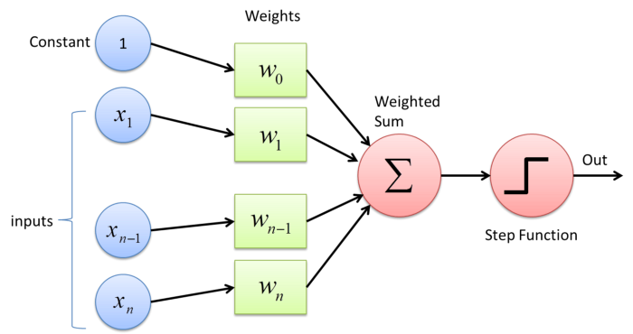
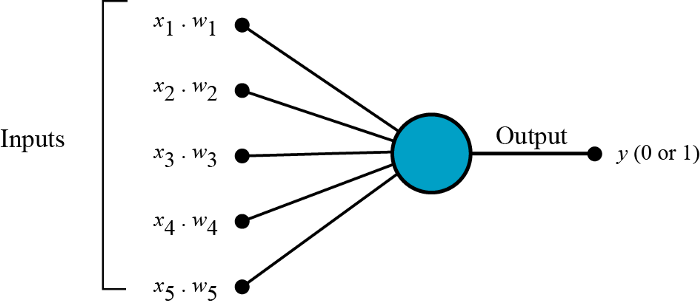
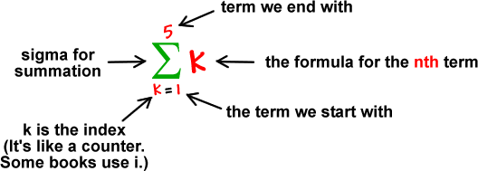
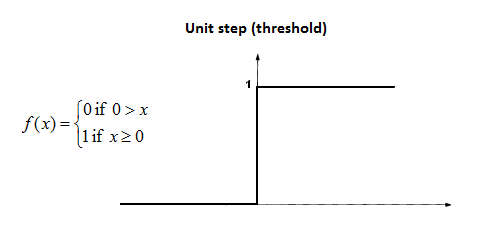
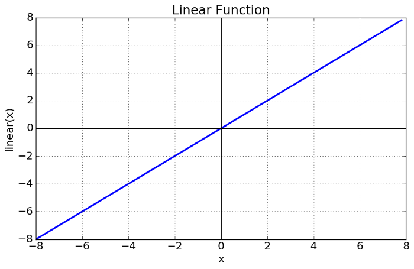
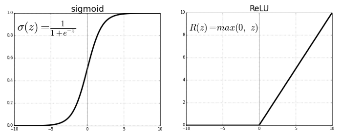
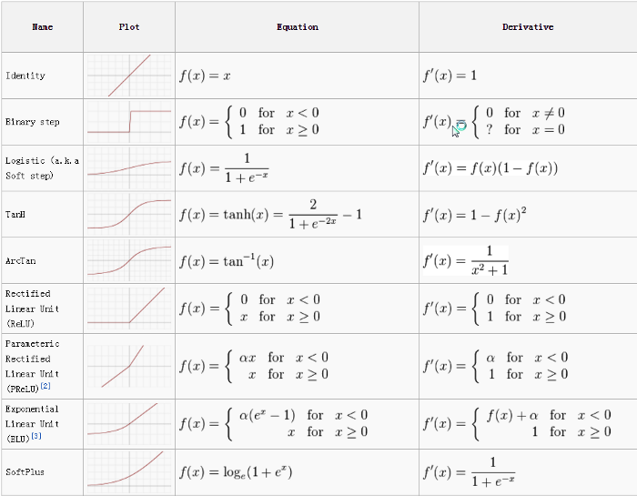
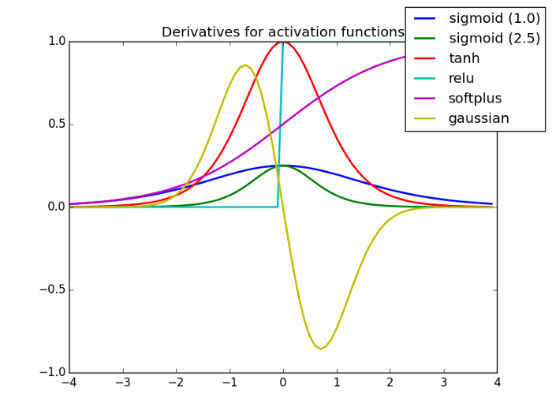
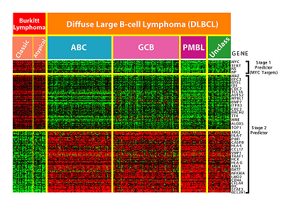

## Métodos Supervisados

## Perceptron
Perceptron is a linear classifier (binary). Also, it is used in supervised learning. It helps to classify the given input data

A Perceptron is an algorithm used for supervised learning of binary classifiers. Binary classifiers decide whether an input, usually represented by a series of vectors, belongs to a specific class.

In short, a perceptron is a single-layer neural network. They consist of four main parts including input values, weights and bias, net sum, and an activation function.

**How does a Perceptron work?**
The process begins by taking all the input values and multiplying them by their weights. Then, all of these multiplied values are added together to create the weighted sum. The weighted sum is then applied to the activation function, producing the perceptron's output. The activation function plays the integral role of ensuring the output is mapped between required values such as (0,1) or (-1,1). It is important to note that the weight of an input is indicative of the strength of a node. Similarly, an input's bias value gives the ability to shift the activation function curve up or down.

Parts of a perceptron:
* Input values or One input layer
* Weights and Bias
* Net Sum
* Activation Function

All the inputs x are multiplied with their weights w. Let’s call it k.

Add all the multiplied values and call them Weighted Sum.

Apply that weighted sum to the correct Activation Function.

**Weights shows the strength of the particular node. A bias value allows**

**In short, the activation functions are used to map the input between the required values like (0, 1) or (-1, 1).**

Perceptron is usually used to classify the data into two parts. Therefore, it is also known as a Linear Binary Classifier

### Activation Function
It’s just a thing function that you use to get the output of node. It is also known as Transfer Function

Why we use Activation functions with Neural Networks?
__It is used to determine the output of neural network like yes or no. It maps the resulting values in between 0 to 1 or -1 to 1 etc. (depending upon the function)__

The Activation Functions can be basically divided into 2 types

* Linear Activation Function
* Non-linear Activation Functions

**Linear or Identity Activation Function**

Equation : f(x) = x

Range : (-infinity to infinity)

**Non-linear Activation Function**
The Nonlinear Activation Functions are the most used activation functions. Nonlinearity helps to makes the graph look something like this

The main terminologies needed to understand for nonlinear functions are:
**Derivative or Differential**: Change in y-axis w.r.t. change in x-axis.It is also known as slope.
**Monotonic function**: A function which is either entirely non-increasing or non-decreasing.

**Sigmoid or Logistic Activation Function**
The Sigmoid Function curve looks like a S-shape

The main reason why we use sigmoid function is because it exists between (0 to 1). Therefore, it is especially used for models where we have to predict the probability as an output.Since probability of anything exists only between the range of 0 and 1, sigmoid is the right choice.

The function is differentiable.That means, we can find the slope of the sigmoid curve at any two points.

The softmax function is a more generalized logistic activation function which is used for multiclass classification.

**Tanh or hyperbolic tangent Activation Function**
tanh is also like logistic sigmoid but better. The range of the tanh function is from (-1 to 1). tanh is also sigmoidal (s - shaped).

The advantage is that the negative inputs will be mapped strongly negative and the zero inputs will be mapped near zero in the tanh graph.

The function is differentiable.
The function is monotonic while its derivative is not monotonic.
The tanh function is mainly used classification between two classes.

**ReLU (Rectified Linear Unit) Activation Function**
The ReLU is the most used activation function in the world right now.Since, it is used in almost all the convolutional neural networks or deep learning.

When updating the curve, to know in which direction and how much to change or update the curve depending upon the slope.That is why we use differentiation in almost every part of Machine Learning and Deep Learning.

### Example of Feedforward Neural Networks
[Ejemplo](https://colab.research.google.com/drive/1ncX2VflQLudR9FLy2WCTpqcUvvF2gS2J?usp=sharing)

## Dimensionalidad
La dimensionalidad en las estadísticas se refiere a cuántos atributos tiene un conjunto de datos. Por ejemplo, los datos de salud son conocidos por tener una gran cantidad de variables (por ejemplo, presión arterial, peso, nivel de colesterol). En un mundo ideal, estos datos podrían representarse en una hoja de cálculo, con una columna que representa cada dimensión. En la práctica, esto es difícil de hacer, en parte porque muchas variables están interrelacionadas (como el peso y la presión arterial).

La dimensionalidad significa algo ligeramente diferente en otras áreas de las matemáticas y la ciencia. Por ejemplo, en física, la dimensionalidad generalmente se puede expresar en términos de dimensiones fundamentales como masa, tiempo o longitud. En álgebra matricial, dos unidades de medida tienen la misma dimensionalidad si ambas afirmaciones son verdaderas:

* Existe una función que asigna una variable a otra variable
* La inversa de la función en (1) hace lo contrario

High Dimensional significa que el número de dimensiones es asombrosamente alto, tan alto que los cálculos se vuelven extremadamente difíciles. Con datos de alta dimensión, la cantidad de características puede exceder la cantidad de observaciones. Por ejemplo, los microarrays, que miden la expresión génica, pueden contener decenas de cientos de muestras. Cada muestra puede contener decenas de miles de genes.

### La maldición de la Dimensionalidad
La generación de información diaria crece y crece generando volumenes tremendamente grandes de datos para analizar. Lo anterior 
ocupa a las empresas,individuos y organizaciones de cualquier industria. Ya que es necesario procesar, analizar y visualizar todos esos datos de forma que generen valor. Desde luego que a más datos mayor cantidad de dimensiones por lo que requerimos de **reducción de dimensionalidad** para poder manejar esos volumenes.

En palabras simples, la reducción de dimensionalidad se refiere a la técnica de reducir la dimensión de un conjunto de características de datos. Por lo general, los conjuntos de datos de aprendizaje automático (conjunto de características) contienen cientos de columnas (es decir, características) o una matriz de puntos, creando una esfera masiva en un espacio tridimensional. Al aplicar la reducción de dimensionalidad, puede disminuir o reducir el número de columnas a recuentos cuantificables, transformando así la esfera tridimensional en un objeto bidimensional (círculo).

Ahora viene la pregunta, ¿por qué debe reducir las columnas en un conjunto de datos cuando puede alimentarlo directamente a un algoritmo ML y dejar que funcione todo por sí mismo?

**La maldición de la dimensionalidad** exige la aplicación de la reducción de la dimensionalidad.

__La maldición de la dimensionalidad__ es un fenómeno que surge cuando se trabaja (analiza y visualiza) con datos en espacios de alta dimensión que no existen en espacios de baja dimensión.

Cuanto mayor sea el número de características o factores (también conocidos como variables) en un conjunto de características, más difícil será visualizar el conjunto de entrenamiento y trabajar en él. Otro punto vital a considerar es que la mayoría de las variables a menudo están correlacionadas. Por lo tanto, si piensa en todas las variables del conjunto de funciones, incluirá muchos factores redundantes en el conjunto de entrenamiento.

Beneficios de la reducción de dimensionalidad:
* Elimina el ruido y las funciones redundantes
* Ayuda a mejorar la precisión y el rendimiento del modelo
* Facilita el uso de algoritmos que no son aptos para dimensiones más sustanciales
* Reduce la cantidad de espacio de almacenamiento requerido (menos datos necesitan menos espacio de almacenamiento)
* Comprime los datos, lo que reduce el tiempo de cálculo y facilita un entrenamiento más rápido de los datos

### Técnicas de reducción de dimensionalidad
Se pueden segmentar en dos grandes grupos: selección de características o extracción de características.

__Selección de características__

* Estrategia de filtrado (Filter strategy)
* Estrategia de envoltura (Wrapper strategy)
* Estrategia integrada (Embedded strategy)

__Extracción de caracteristicas__
La extracción de características, también conocida como proyección de características, convierte los datos del espacio de alta dimensión a uno con dimensiones menores. Esta transformación de datos puede ser lineal o no lineal también. Esta técnica encuentra un conjunto más pequeño de nuevas variables, cada una de las cuales es una combinación de variables de entrada (que contienen la misma información que las variables de entrada).

Algunas de las técnicas más comunes de reducción de dimensionalidad son:

* Principal Component Analysis (PCA)
* Non-negative matrix factorization (NMF)
* Linear discriminant analysis (LDA)
* Generalized discriminant analysis (GDA)
* Missing Values Ratio
* Low Variance Filter
* High Correlation Filter
* Backward Feature Elimination
* Forward Feature Construction
* Random Forests

### Análisis de componentes principales (PCA)
En estadística, el análisis de componentes principales (en español ACP, en inglés, PCA) es una técnica utilizada para describir un conjunto de datos en términos de nuevas variables («componentes») no correlacionadas. Los componentes se ordenan por la cantidad de varianza original que describen, por lo que la técnica es útil para reducir la dimensionalidad de un conjunto de datos.

Técnicamente, el ACP busca la proyección según la cual los datos queden mejor representados en términos de mínimos cuadrados. Esta convierte un conjunto de observaciones de variables posiblemente correlacionadas en un conjunto de valores de variables sin correlación lineal llamadas componentes principales.

El ACP se emplea sobre todo en análisis exploratorio de datos y para construir modelos predictivos. El ACP comporta el cálculo de la descomposición en autovalores de la matriz de covarianza, normalmente tras centrar los datos en la media de cada atributo.

El análisis de componentes principales es una de las principales técnicas lineales de reducción de dimensionalidad. Este método realiza un mapeo directo de los datos a un espacio de menor dimensión de una manera que maximiza la varianza de los datos en la representación de baja dimensión.

Esencialmente, es un procedimiento estadístico que convierte ortogonalmente las "n" coordenadas de un conjunto de datos en un nuevo conjunto de n coordenadas, conocidas como componentes principales. Esta conversión da como resultado la creación del primer componente principal que tiene la varianza máxima. Cada componente principal sucesivo tiene la varianza más alta posible, con la condición de que sea ortogonal (no correlacionado) con los componentes anteriores.

La conversión de PCA es sensible al escalado relativo de las variables originales. Por lo tanto, los rangos de las columnas de datos primero deben normalizarse antes de implementar el método PCA. Otra cosa para recordar es que el uso del enfoque de PCA hará que su conjunto de datos pierda su **interpretabilidad**. Por lo tanto, si la interpretabilidad es crucial para su análisis, el PCA no es el método de reducción de dimensionalidad adecuado para su proyecto.

Limitaciones de PCA:
* PCA no es invariante en escala. comprobar: primero tenemos que escalar nuestros datos
* Se supone que las direcciones con la mayor varianza son las de mayor interés
* Solo considera transformaciones ortogonales (rotaciones) de las variables originales
* El PCA solo se basa en el vector medio y la matriz de covarianza. Algunas distribuciones (normal multivariante) se caracterizan por esto, pero otras no
* Si las variables están correlacionadas, PCA puede lograr una reducción de dimensión. Si no, PCA simplemente los ordena de acuerdo con sus variaciones

[Ejemplo](https://colab.research.google.com/drive/1waq7rX6WnXm28dFQdwnEhG8Op4N7lgO6?usp=sharing)

[Ejercicio PCA MNIST](https://github.com/mGalarnyk/Python_Tutorials/blob/master/Sklearn/PCA/PCA_to_Speed-up_Machine_Learning_Algorithms.ipynb)

[Explicación del Ejercicio](https://towardsdatascience.com/pca-using-python-scikit-learn-e653f8989e60)

### Tutorial 

[Tutorial Cancer de Seno](https://www.datacamp.com/community/tutorials/principal-component-analysis-in-python)

### Lecturas complementarias

[What is a Perceptron? – Basics of Neural Networks](https://towardsdatascience.com/what-is-a-perceptron-basics-of-neural-networks-c4cfea20c590)

[Perceptron](https://www.sciencedirect.com/topics/engineering/perceptron)

[PCA using Python (scikit-learn)](https://towardsdatascience.com/pca-using-python-scikit-learn-e653f8989e60)

[Introduction to Artificial Neural Networkswith Keras](https://app.box.com/s/n5zaxhmlt0vb6yy98cj59goaq2elqfjh)

### Aditional Videos
[Principal Component Analysis (PCA), Step-by-Step](https://youtu.be/FgakZw6K1QQ)

[¡Ideas principales de PCA en solo 5 minutos!](https://youtu.be/HMOI_lkzW08)

[IA NOTEBOOK #4 | Programando Red Neuronal desde Cero! | Programando IA](https://www.youtube.com/watch?v=W8AeOXa_FqU)

[Procesamiento de datos (PCA)](https://www.youtube.com/watch?v=b1NGM3IbRcI)

[Principal Component Analysis (PCA), Step-by-Step](https://youtu.be/FgakZw6K1QQ)

[Cómo guardar un modelo entrenado](https://youtu.be/5X3xWlJ2Ozw)

### Papers

[Principal component analysis: a review and recent developments](https://royalsocietypublishing.org/doi/full/10.1098/rsta.2015.0202)

[Geometrical Approximated Principal Component Analysis for Hyperspectral Image Analysis](https://www.mdpi.com/2072-4292/12/11/1698/htm)

[Robust Principal Component Analysis with Adaptive Neighbors](http://papers.nips.cc/paper/8919-robust-principal-component-analysis-with-adaptive-neighbors)

## Assignments
* Mediante PCA cree un algortihmo que permita identificar los componentes principales de images de rostros de 512x512, para ellos todos los estudiantes proporcionaran 10 fotos(Almacenarlas [aquí](https://drive.google.com/drive/folders/1IhufSGU5Llbp_3pO8lw2A4g3cz12IlRB?usp=sharing)). Las fotos deberan estar alineadas, esto que quiere decir que al tomarse la foto de solo la cara esta debe estar alineada horizontalmente, los dos ojos a la misma altura de frente. Se deben indicar cualas son las componentes principales que PCA determino sobre la matriz de datos de las imagenes. Se realiza en parejas y se entrega el 3 de noviembre de 2021 mediante Tec-Digital. Basado en [Face-Recognition](https://github.com/syedhope/Face-Recognition) cree el algoritmo que utilizando LBP y PCA puede realizar el reconocimiento de caras de los compañeros de clase. Creen sus propios algoritmos y los documentan a modo de defender lo que hacen para la revisión posterior.
* Basado en [The Perceptron](https://app.box.com/s/hlltz9flx3b2ah5ovs1ennqyztydcv1b) desarrollo una infografía sobre el perceptron

## Fuentes
[Top 10 Dimensionality Reduction Techniques For Machine Learning](https://www.upgrad.com/blog/top-dimensionality-reduction-techniques-for-machine-learning/#:~:text=In%20simple%20words%2C%20dimensionality%20reduction%20refers%20to%20the,creating%20a%20massive%20sphere%20in%20a%20three-dimensional%20space.)

[Principle Component Analysis (PCA) for Data Visualization](https://github.com/mGalarnyk/Python_Tutorials/blob/master/Sklearn/PCA/PCA_Data_Visualization_Iris_Dataset_Blog.ipynb)

