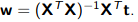
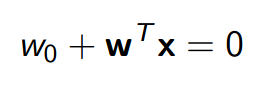

# Least squares for classification
The idea of using least squares to create a linear classifier is to define a linear function.

Using **Regression** as **Classification** the main idea is map the input x from X (observations) to a label __t__ from Y. Now Y is categorial :).
Suppose we have a binary problem where t is include in {-1,1}. Using the standard model for lineal regression.

To optain w we can use least squares . We need to compute X and t, we need to find minimun loss.
Maybe we can use this:

For a one dimensional example where input **x** is __1-dim__

The color indicate labels so the blues denote __t__ from the first class and reds circles denote __t__ from the second class.

So in the plane we can see

The classifier has the form

The decision rule it will be

The final result could be

The linear classfier has a __linear boundary(hyperplane)__ 

So it is possible to see the two "half-spaces" in the plane. The linear boundary in the hyperplane it is represent in next mathematical formula.

## Learning Linear Classifiers
The main idea is implement a process of learning to estimate a "good" decision boundary. We need to find a w (direction) and w0 (location) of the boundary.

**Problem What does __good__ mean?**

So we need a criteria that tell us how to select the parameters for have a "good" boundary. Classifying using a linear decision boundary reduces the data dimension to 1.

What is the cost of being wrong?. __Loss function__ L(y,t) is the loss incurred for predicting y when correct answer is t.

A possible loss to minimiza is the **zero/one loss** 

Other Loss Functions

## Metrics
Is really important know how good my classifier it is. So we need to compute this values.
**TP (True positive), FP(False Positive), FN(False Negative)**

How evaluate how good 
**Precision** is the fraction of retrieved instances that are relevant
**Recall** is the faction of relevant instances that are retrieved
**Average Precision (AP)** mean under the curve

Precision Recall Curve

## Metric vs Loss

It is important know:
* Metrics on a dataset is what we care about (performance)
* We typically cannot directly optimize for the metrics
* Our loss function should reflect the problem we are solving.

# Fisher's Linear Discriminant 2 or more classes
To deal with classification problems with 2 or more classes, most Machine Learning (ML) algorithms work the same way. 

Usually, they apply some kind of transformation to the input data with the effect of reducing the original input dimensions to a new (smaller) one. The goal is to project the data to a new space. Then, once projected, they try to classify the data points by finding a linear separation.

For problems with small input dimensions, the task is somewhat easier. Take the following dataset as an example.

Suppose we want to classify the red and blue circles correctly. It is clear that with a simple linear model we will not get a good result. There is no linear combination of the inputs and weights that maps the inputs to their correct classes. But what if we could transform the data so that we could draw a line that separates the 2 classes?

That is what happens if we square the two input feature-vectors. Now, a linear model will easily classify the blue and red points.

One solution to this problem is to learn the right transformation. This is known as representation learning and it is exactly what you are thinking - Deep Learning. The magic is that we do not need to “guess” what kind of transformation would result in the best representation of the data. The algorithm will figure it out.

However, keep in mind that regardless of representation learning or hand-crafted features, the pattern is the same. We need to change the data somehow so that it can be easily separable.

**Fisher’s Linear Discriminant**
We can view linear classification models in terms of dimensionality reduction.

To begin, consider the case of a two-class classification problem (K=2). Blue and red points in R². In general, we can take any D-dimensional input vector and project it down to D’-dimensions. Here, D represents the original input dimensions while D’ is the projected space dimensions. Throughout this article, consider D’ less than D.

In the case of projecting to one dimension (the number line), i.e. D’=1, we can pick a threshold t to separate the classes in the new space. Given an input vector x:

    if the predicted value y >= t then, x belongs to class C1 (class 1) - where .
    otherwise, it is classified as C2 (class 2).

Take the dataset below as a toy example. We want to reduce the original data dimensions from D=2 to D’=1. In other words, we want a transformation T that maps vectors in 2D to 1D - T(v) = ℝ² →ℝ¹.

First, let’s compute the mean vectors m1 and m2 for the two classes.

Note that N1 and N2 denote the number of points in classes C1 and C2 respectively. Now, consider using the class means as a measure of separation. In other words, we want to project the data onto the vector W joining the 2 class means.

It is important to note that any kind of projection to a smaller dimension might involve some loss of information. In this scenario, note that the two classes are clearly separable (by a line) in their original space. 

However, after re-projection, the data exhibit some sort of class overlapping - shown by the yellow ellipse on the plot and the histogram below.

**The idea proposed by Fisher is to maximize a function that will give a large separation between the projected class means while also giving a small variance within each class, thereby minimizing the class overlap.**

Fisher selects a projections that maximizes the class separation. Maximazing the ratio between the between-class variance to the within-class variance.

In short, to project the data to a smaller dimension and to avoid class overlapping, FLD maintains 2 properties.
* A large variance among the dataset classes.
* A small variance within each of the dataset classes.

To find the projection with the following properties, FLD learns a weight vector W with the following criterion.

If we substitute the mean vectors m1 and m2 as well as the variance s as given by equations (1) and (2) we arrive at equation (3). If we take the derivative of (3) w.r.t W (after some simplifications) we get the learning equation for W (equation 4). That is, W (our desired transformation) is directly proportional to the inverse of the within-class covariance matrix times the difference of the class means.

**Fisher’s Linear Discriminant for Multiple Classes**

### Ejemplo completo
[Example compare different approach](https://drive.google.com/file/d/17H8On3pLaDZ4RlQkOcEAUYxMo_-KgNuZ/view?usp=sharing)
[Multivariable exmple](https://drive.google.com/file/d/19AizOC1zIL-Lh1mVpxTYMHgvUtIqgMkH/view?usp=sharing)

